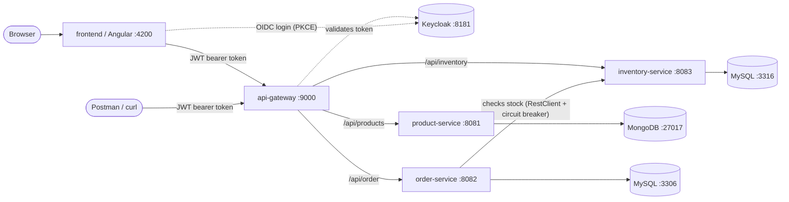

# ecommerce-microservices

A small e-commerce system built as a set of independent Spring Boot microservices, fronted by a single API gateway, with an Angular SPA on top. This project is a hands-on way to learn the core building blocks of a microservices architecture: service independence, an API gateway, centralized authentication, API documentation aggregation, and resilience patterns.

It's based on the ["Spring Boot Microservices" tutorial series by Programming Techie](https://programmingtechie.com/articles/spring-boot-microservices-tutorial-part-1), extended and adapted to newer Spring Boot / Spring Cloud versions, plus [Part 7](https://programmingtechie.com/articles/spring-boot-microservices-tutorial-part-7) for the frontend (adapted to this repo's actual API contracts).

## Table of contents

- [Architecture](#architecture)
- [Services at a glance](#services-at-a-glance)
- [Prerequisites](#prerequisites)
- [Quick start](#quick-start)
- [Setting up Keycloak (required for the gateway)](#setting-up-keycloak-required-for-the-gateway)
- [Calling the system through the gateway](#calling-the-system-through-the-gateway)
- [API documentation (Swagger UI)](#api-documentation-swagger-ui)
- [Resilience: circuit breaker demo](#resilience-circuit-breaker-demo)
- [Project structure](#project-structure)
- [Why these design choices](#why-these-design-choices)
- [Troubleshooting](#troubleshooting)

## Architecture



Every service is a standalone Spring Boot application with its own database — no service reaches into another service's database directly. The **only** way services talk to each other is over HTTP (order-service calls inventory-service's REST API). The **api-gateway** is the single public entry point: clients never call `product-service`, `order-service`, or `inventory-service` directly, they always go through the gateway on port 9000. The **frontend** is just another gateway client — it never calls a backend service directly either.

## Services at a glance

| Service | Port | Database | Responsibility |
|---|---|---|---|
| `frontend` | 4200 | — | Angular SPA. Product listing/ordering, create-product form. All calls go through the gateway. |
| `api-gateway` | 9000 | — | Single entry point. Routes requests to the right service, enforces JWT authentication, aggregates Swagger docs, applies circuit breakers. |
| `product-service` | 8081 | MongoDB `:27017` | Product catalog (create/list products). |
| `order-service` | 8082 | MySQL `:3306` | Places orders. Before saving an order, it calls `inventory-service` to check stock. |
| `inventory-service` | 8083 | MySQL `:3316` | Tracks stock levels per SKU; add/upsert stock, check availability. No more seeded/hardcoded SKUs — stock is created through the API as products are added. |

Supporting infrastructure:

| Component | Port | Purpose |
|---|---|---|
| Keycloak | 8181 | Issues and validates JWTs. The gateway rejects any request without a valid token. |

## Prerequisites

- **JDK 17**
- **Maven** (or use the `mvnw`/`mvnw.cmd` wrapper committed in each service — no local Maven install required)
- **Docker** (for MongoDB, MySQL, and Keycloak) — each service ships its own `docker-compose.yml` for its own dependency

## Quick start

Clone the repo and start each service's infrastructure and app. Every service is independent, so start them in any order — but `order-service` won't be able to place orders until `inventory-service` is also reachable.

### 1. product-service (port 8081, MongoDB)

```bash
cd product-service
docker compose up -d      # starts MongoDB on 27017
./mvnw spring-boot:run
```

### 2. inventory-service (port 8083, MySQL)

```bash
cd inventory-service
docker compose up -d      # starts MySQL on 3316
./mvnw spring-boot:run
```

### 3. order-service (port 8082, MySQL)

```bash
cd order-service
docker compose up -d      # starts MySQL on 3306
./mvnw spring-boot:run
```

### 4. api-gateway (port 9000)

The gateway needs Keycloak running *and configured* before it can authenticate anyone (see the next section) — but it will boot fine without Keycloak, since the JWT issuer is only contacted lazily on the first token validation.

```bash
cd api-gateway
docker compose up -d      # starts Keycloak (+ its own MySQL) on 8181
./mvnw spring-boot:run
```

### 5. frontend (port 4200, Angular)

Requires Node.js. Needs the Keycloak public client set up first — see [`frontend/README.md`](frontend/README.md#one-time-keycloak-setup-public-client-for-the-spa).

```bash
cd frontend
npm install
npm start          # ng serve, http://localhost:4200
```

> ⚠️ `application.properties` in each service has local dev DB credentials hardcoded (matching the default `docker-compose.yml` values). Override via environment variables for anything beyond local development — never commit real secrets.

## Setting up Keycloak (required for the gateway)

The gateway is an OAuth2 **resource server**: every request must carry a valid JWT issued by Keycloak, or it's rejected with `401`. The realm isn't pre-provisioned in this repo, so you need to create it once:

1. Open `http://localhost:8181` and log in with `admin` / `admin`.
2. Create a new realm named **`spring-microservices-realm`** (must match `spring.security.oauth2.resourceserver.jwt.issuer-uri` in `api-gateway/src/main/resources/application.properties`).
3. Inside that realm, create a client (e.g. `test-client-id`):
   - **Client authentication**: On
   - **Authentication flow**: enable *Service accounts roles* (this gives you the client-credentials grant, ideal for testing with Postman/curl without a real user)
4. Open the client's **Credentials** tab and copy the **Client secret**.
5. Get a token:

```bash
curl -X POST http://localhost:8181/realms/spring-microservices-realm/protocol/openid-connect/token \
  -H "Content-Type: application/x-www-form-urlencoded" \
  -d "grant_type=client_credentials&client_id=test-client-id&client_secret=<paste-secret-here>"
```

This returns an `access_token` — use it as a `Bearer` token on every call to the gateway.

## Calling the system through the gateway

All client traffic goes through **`http://localhost:9000`**, never directly to a service port.

```bash
TOKEN="<paste access_token here>"

# List products
curl -H "Authorization: Bearer $TOKEN" http://localhost:9000/api/products

# Place an order (checks stock via inventory-service under the hood)
curl -X POST http://localhost:9000/api/order \
  -H "Authorization: Bearer $TOKEN" -H "Content-Type: application/json" \
  -d '{"skuCode":"iphone_15","price":1000,"quantity":1}'

# Check inventory directly
curl -H "Authorization: Bearer $TOKEN" "http://localhost:9000/api/inventory?skuCode=iphone_15&quantity=1"
```

| Gateway route | Forwards to |
|---|---|
| `/api/products` | `product-service:8081` |
| `/api/order` | `order-service:8082` |
| `/api/inventory` | `inventory-service:8083` |

## API documentation (Swagger UI)

Each service publishes its own OpenAPI spec (`springdoc-openapi`), and the gateway aggregates all three into one Swagger UI with a service picker:

```
http://localhost:9000/swagger-ui.html
```

This works without authentication (docs endpoints are explicitly permitted in the gateway's security config) and without needing to know each service's port.

Individually, each service also exposes its own docs directly:
- `http://localhost:8081/swagger-ui.html` (product-service)
- `http://localhost:8082/swagger-ui.html` (order-service)
- `http://localhost:8083/swagger-ui.html` (inventory-service)

## Resilience: circuit breaker demo

Two independent circuit breakers protect this system from cascading failures (via [Resilience4j](https://resilience4j.readme.io/)):

1. **Gateway → services**: every gateway route (`/api/products`, `/api/order`, `/api/inventory`) is wrapped in a circuit breaker. If the target service is unreachable, the gateway returns a clean `503 Service Unavailable` instead of a raw connection error.
2. **order-service → inventory-service**: `order-service` calls `inventory-service` through a `RestClient`-backed HTTP interface, wrapped in a circuit breaker + retry. If `inventory-service` is down, the call fails fast and `order-service` treats the SKU as out of stock (fallback returns `false`) rather than hanging.

Try it yourself:

```bash
# Stop product-service, then hit its route through the gateway
curl -H "Authorization: Bearer $TOKEN" http://localhost:9000/api/products
# => "Service Unavailable, please try again later" (HTTP 503)
```

## Project structure

```
ecommerce-microservices/
├── frontend/              # Angular SPA: product listing/ordering, create-product form
├── api-gateway/          # Single entry point: routing, JWT auth, Swagger aggregation, circuit breakers
├── product-service/       # Product catalog (MongoDB)
├── order-service/          # Order placement (MySQL) — calls inventory-service
├── inventory-service/       # Stock tracking (MySQL)
└── README.md
```

Each backend service follows the same internal layout:

```
src/main/java/com/techie/microservices/<service>/
├── config/          # OpenAPIConfig, (RestClientConfig for order-service)
├── controller/      # REST endpoints
├── service/         # Business logic
├── repository/      # Spring Data repository
├── model/           # JPA/Mongo entity
└── dto/             # Request/response payloads
```

CORS is handled once, centrally, in `api-gateway`'s `SecurityConfig` — the individual services don't have their own `CorsConfig` since clients never call them directly. See [`frontend/README.md`](frontend/README.md#notes-on-deviations-from-the-tutorial-article) for the full list of backend adjustments made to support the SPA (including `POST /api/inventory` for adding stock, and `skuCode` on `product-service`'s `Product`).

## Why these design choices

A few decisions here are deliberately different from a "simplest possible" setup, because they're the actual point of the exercise:

- **The gateway is the only public entry point.** Services never trust a caller directly — even in local dev, calling `product-service:8081` directly bypasses authentication entirely. That's fine for local debugging, but in a real deployment those ports wouldn't be exposed at all.
- **order-service doesn't use a shared library or direct DB access to check stock.** It makes a real HTTP call to inventory-service. This is what makes the circuit breaker/retry/fallback behavior meaningful — the failure mode being handled is a genuine network/service failure, not a simulated one.
- **Spring Cloud Gateway's WebMvc flavor** (`spring-cloud-starter-gateway-server-webmvc`), not the reactive/WebFlux gateway. This keeps the whole stack on the familiar Servlet/MVC programming model used by the other three services, at the cost of the gateway being blocking rather than reactive (fine at this scale).
- **`api-gateway` is on Spring Boot 4 / Spring Cloud `2025.1.2`**, while the three backend services are on Spring Boot 3.5 / Spring Cloud `2025.0.0`. This is intentional, not an oversight left over from an upgrade in progress — see the troubleshooting note below on why the versions must be paired correctly per module.

## Troubleshooting

**A service throws `NoClassDefFoundError` on some Spring Cloud class right at startup.**
Spring Cloud release trains are tied to a specific Spring Boot major version — `2025.0.x` pairs with Spring Boot 3.5.x, `2025.1.x` pairs with Spring Boot 4.0.x. Mixing them (e.g. Spring Boot 3.5 with Spring Cloud `2025.1.x`) compiles fine but crashes at runtime, because some auto-configured beans reference classes/packages that only exist in the other Boot generation (this bit us with Feign + Jackson 3 classes during development). Check that each module's `<spring-cloud.version>` matches its `spring-boot-starter-parent` version's compatible train.

**Gateway returns 401 on a path that's supposed to be public (`/swagger-ui.html`, `/aggregate/**`, etc.), even though it's listed in `SecurityConfig`'s permit-list.**
Spring Boot internally *forwards* failed requests to `/error` to render the error body, and that forward re-enters the same security filter chain. If the *real* underlying request failed for some other reason (e.g. the downstream service is down) and `/error` itself isn't permitted, you'll see a misleading `401` that has nothing to do with authentication. Make sure `/error` (and `/fallbackRoute`, if you're using the circuit breaker fallback) are in the permit-list.

**Gateway route returns 404 even though the target service is healthy.**
Double check the route's path predicate in `RouteConfig` matches the target controller's actual `@RequestMapping` exactly — the gateway does no path rewriting beyond what's explicit in `.before(BeforeFilterFunctions.setPath(...))`.

**`order-service`'s test build fails on `AutoConfigureWireMock` (`cannot find symbol`).**
This is a pre-existing test-only issue in `OrderServiceApplicationTests.java` unrelated to the main application — the app itself builds and runs fine with `-Dmaven.test.skip=true` if you hit this.
