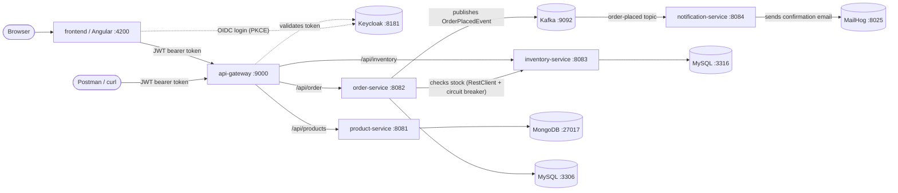

# ecommerce-microservices

A small e-commerce system built as a set of independent Spring Boot microservices, fronted by a single API gateway, with an Angular SPA on top, Kafka tying the backend together for event-driven workflows, and a full Grafana observability stack (logs, metrics, traces) watching all of it. This project is a hands-on way to learn the core building blocks of a microservices architecture: service independence, an API gateway, centralized authentication, API documentation aggregation, resilience patterns, asynchronous event-driven communication, and observability.

It's based on the ["Spring Boot Microservices" tutorial series by Programming Techie](https://programmingtechie.com/articles/spring-boot-microservices-tutorial-part-1), extended and adapted to newer Spring Boot / Spring Cloud versions, [Part 7](https://programmingtechie.com/articles/spring-boot-microservices-tutorial-part-7) for the frontend, [Part 8](https://programmingtechie.com/articles/spring-boot-microservices-tutorial-part-8) for the Kafka event-driven piece, and [Part 9](https://programmingtechie.com/articles/spring-boot-microservices-tutorial-part-9) for observability (all adapted to this repo's actual API contracts and ports).

## Table of contents

- [Architecture](#architecture)
- [Services at a glance](#services-at-a-glance)
- [Prerequisites](#prerequisites)
- [Quick start](#quick-start)
- [Setting up Keycloak (required for the gateway)](#setting-up-keycloak-required-for-the-gateway)
- [Calling the system through the gateway](#calling-the-system-through-the-gateway)
- [API documentation (Swagger UI)](#api-documentation-swagger-ui)
- [Resilience: circuit breaker demo](#resilience-circuit-breaker-demo)
- [Event-driven order confirmations (Kafka)](#event-driven-order-confirmations-kafka)
- [Observability: logs, metrics, and traces (Grafana stack)](#observability-logs-metrics-and-traces-grafana-stack)
- [Project structure](#project-structure)
- [Why these design choices](#why-these-design-choices)
- [Troubleshooting](#troubleshooting)

## Architecture



Every service is a standalone Spring Boot application with its own database — no service reaches into another service's database directly. Services talk to each other two ways: synchronously over HTTP (order-service calls inventory-service's REST API directly, and needs an answer before it can proceed) and asynchronously over Kafka (order-service publishes an event and moves on; notification-service picks it up whenever it's ready — order-service never even knows notification-service exists). The **api-gateway** is the single public entry point for all synchronous, request/response traffic: clients never call `product-service`, `order-service`, or `inventory-service` directly, they always go through the gateway on port 9000. The **frontend** is just another gateway client — it never calls a backend service directly either. `notification-service` has no REST API and isn't behind the gateway at all — it only reacts to Kafka events.

## Services at a glance

| Service | Port | Database | Responsibility |
|---|---|---|---|
| `frontend` | 4200 | — | Angular SPA. Product listing/ordering, create-product form. All calls go through the gateway. |
| `api-gateway` | 9000 | — | Single entry point. Routes requests to the right service, enforces JWT authentication, aggregates Swagger docs, applies circuit breakers. |
| `product-service` | 8081 | MongoDB `:27017` | Product catalog (create/list products). |
| `order-service` | 8082 | MySQL `:3306` | Places orders. Before saving an order, it calls `inventory-service` to check stock. After saving, it publishes an `OrderPlacedEvent` to Kafka. |
| `inventory-service` | 8083 | MySQL `:3316` | Tracks stock levels per SKU; add/upsert stock, check availability. No more seeded/hardcoded SKUs — stock is created through the API as products are added. |
| `notification-service` | 8084 | — | No REST API. Consumes `order-placed` events from Kafka and emails the customer an order confirmation. |

Supporting infrastructure:

| Component | Port | Purpose |
|---|---|---|
| Keycloak | 8181 | Issues and validates JWTs. The gateway rejects any request without a valid token. |
| Kafka | 9092 | Durable event log that decouples `order-service` (producer) from `notification-service` (consumer) — see [Event-driven order confirmations](#event-driven-order-confirmations-kafka). |
| Schema Registry | 8085 | Stores and validates the Avro contract (`OrderPlacedEvent`) shared by producer and consumer. |
| Kafka UI | 8086 | Dashboard for browsing topics, messages, and consumer group lag. |
| MailHog | 8025 (UI) / 1025 (SMTP) | Fake local SMTP server — order confirmation emails land here instead of a real inbox. |
| Grafana | 3000 | Dashboards over all three signals below — see [Observability](#observability-logs-metrics-and-traces-grafana-stack). |
| Prometheus | 9090 | Scrapes `/actuator/prometheus` on every service every 2s (metrics). |
| Loki | 3100 | Log aggregation — every service ships its logs here via a Logback appender. |
| Tempo | 3200 (query) / 9411 (zipkin ingest) | Distributed trace storage. |

## Prerequisites

- **JDK 17**
- **Maven** (or use the `mvnw`/`mvnw.cmd` wrapper committed in each service — no local Maven install required)
- **Docker** (for MongoDB, MySQL, and Keycloak) — each service ships its own `docker-compose.yml` for its own dependency

## Quick start

Clone the repo and start each service's infrastructure and app. Every service is independent, so start them in any order — but `order-service` won't be able to place orders until `inventory-service` is also reachable.

### 1. product-service (port 8081, MongoDB)

```bash
cd product-service
docker compose up -d      # starts MongoDB on 27017
./mvnw spring-boot:run
```

### 2. inventory-service (port 8083, MySQL)

```bash
cd inventory-service
docker compose up -d      # starts MySQL on 3316
./mvnw spring-boot:run
```

### 3. order-service (port 8082, MySQL + Kafka stack)

`order-service`'s `docker-compose.yml` also brings up Kafka, Zookeeper, Schema Registry, and Kafka UI — it's the natural home for that stack since it's the event producer. First boot takes a bit longer than the others while the Kafka images pull.

```bash
cd order-service
docker compose up -d      # starts MySQL on 3306, Kafka on 9092, Schema Registry on 8085, Kafka UI on 8086
./mvnw spring-boot:run
```

### 4. notification-service (port 8084, Kafka consumer)

No database, no gateway route — this one just listens to Kafka and sends email. Needs `order-service`'s Kafka stack (step 3) already running.

```bash
cd notification-service
docker compose up -d      # starts MailHog: SMTP on 1025, web UI on 8025
./mvnw spring-boot:run
```

### 5. api-gateway (port 9000)

The gateway needs Keycloak running *and configured* before it can authenticate anyone (see the next section) — but it will boot fine without Keycloak, since the JWT issuer is only contacted lazily on the first token validation.

```bash
cd api-gateway
docker compose up -d      # starts Keycloak (+ its own MySQL) on 8181
./mvnw spring-boot:run
```

### 6. frontend (port 4200, Angular)

Requires Node.js. Needs the Keycloak public client set up first — see [`frontend/README.md`](frontend/README.md#one-time-keycloak-setup-public-client-for-the-spa). Also needs the `email` scope, already included in `auth.config.ts` — the order-confirmation flow needs the logged-in user's email/name from the ID token.

```bash
cd frontend
npm install
npm start          # ng serve, http://localhost:4200
```

> ⚠️ `application.properties` in each service has local dev DB credentials hardcoded (matching the default `docker-compose.yml` values). Override via environment variables for anything beyond local development — never commit real secrets.

## Setting up Keycloak (required for the gateway)

The gateway is an OAuth2 **resource server**: every request must carry a valid JWT issued by Keycloak, or it's rejected with `401`. The realm isn't pre-provisioned in this repo, so you need to create it once:

1. Open `http://localhost:8181` and log in with `admin` / `admin`.
2. Create a new realm named **`spring-microservices-realm`** (must match `spring.security.oauth2.resourceserver.jwt.issuer-uri` in `api-gateway/src/main/resources/application.properties`).
3. Inside that realm, create a client (e.g. `test-client-id`):
   - **Client authentication**: On
   - **Authentication flow**: enable *Service accounts roles* (this gives you the client-credentials grant, ideal for testing with Postman/curl without a real user)
4. Open the client's **Credentials** tab and copy the **Client secret**.
5. Get a token:

```bash
curl -X POST http://localhost:8181/realms/spring-microservices-realm/protocol/openid-connect/token \
  -H "Content-Type: application/x-www-form-urlencoded" \
  -d "grant_type=client_credentials&client_id=test-client-id&client_secret=<paste-secret-here>"
```

This returns an `access_token` — use it as a `Bearer` token on every call to the gateway.

## Calling the system through the gateway

All client traffic goes through **`http://localhost:9000`**, never directly to a service port.

```bash
TOKEN="<paste access_token here>"

# List products
curl -H "Authorization: Bearer $TOKEN" http://localhost:9000/api/products

# Place an order (checks stock via inventory-service, then publishes an OrderPlacedEvent to Kafka)
curl -X POST http://localhost:9000/api/order \
  -H "Authorization: Bearer $TOKEN" -H "Content-Type: application/json" \
  -d '{"skuCode":"iphone_15","price":1000,"quantity":1,"userDetails":{"email":"test@example.com","firstName":"Test","lastName":"User"}}'

# Check inventory directly
curl -H "Authorization: Bearer $TOKEN" "http://localhost:9000/api/inventory?skuCode=iphone_15&quantity=1"
```

| Gateway route | Forwards to |
|---|---|
| `/api/products` | `product-service:8081` |
| `/api/order` | `order-service:8082` |
| `/api/inventory` | `inventory-service:8083` |

## API documentation (Swagger UI)

Each service publishes its own OpenAPI spec (`springdoc-openapi`), and the gateway aggregates all three into one Swagger UI with a service picker:

```
http://localhost:9000/swagger-ui.html
```

This works without authentication (docs endpoints are explicitly permitted in the gateway's security config) and without needing to know each service's port.

Individually, each service also exposes its own docs directly:
- `http://localhost:8081/swagger-ui.html` (product-service)
- `http://localhost:8082/swagger-ui.html` (order-service)
- `http://localhost:8083/swagger-ui.html` (inventory-service)

## Resilience: circuit breaker demo

Two independent circuit breakers protect this system from cascading failures (via [Resilience4j](https://resilience4j.readme.io/)):

1. **Gateway → services**: every gateway route (`/api/products`, `/api/order`, `/api/inventory`) is wrapped in a circuit breaker. If the target service is unreachable, the gateway returns a clean `503 Service Unavailable` instead of a raw connection error.
2. **order-service → inventory-service**: `order-service` calls `inventory-service` through a `RestClient`-backed HTTP interface, wrapped in a circuit breaker + retry. If `inventory-service` is down, the call fails fast and `order-service` treats the SKU as out of stock (fallback returns `false`) rather than hanging.

Try it yourself:

```bash
# Stop product-service, then hit its route through the gateway
curl -H "Authorization: Bearer $TOKEN" http://localhost:9000/api/products
# => "Service Unavailable, please try again later" (HTTP 503)
```

## Event-driven order confirmations (Kafka)

Placing an order does two things: it's saved to `order-service`'s database (synchronous, request/response, part of the HTTP call), and it publishes an `OrderPlacedEvent` to Kafka (fire-and-forget — `order-service` doesn't wait for or know about anything that happens next). `notification-service` subscribes to that event and sends a confirmation email. This is the difference between the HTTP calls elsewhere in this system (order-service *needs* inventory-service's answer before it can save the order) and an event (order-service doesn't need anyone to be listening at all).

**Message format**: events are serialized as **Avro**, not raw JSON, validated against a schema stored in the **Confluent Schema Registry**. Both `order-service` (producer) and `notification-service` (consumer) declare the same contract independently, in `src/main/resources/avro/order-placed.avsc`:

```json
{
  "type": "record",
  "name": "OrderPlacedEvent",
  "namespace": "com.techie.microservices.order.event",
  "fields": [
    { "name": "orderNumber", "type": "string" },
    { "name": "email", "type": "string" },
    { "name": "firstName", "type": "string" },
    { "name": "lastName", "type": "string" }
  ]
}
```

The `avro-maven-plugin` generates `OrderPlacedEvent.java` from this file at build time (`generate-sources` phase, output under `target/generated-sources/avro` — not committed, like any other generated code). Using Avro + Schema Registry instead of plain JSON means a producer can't silently start sending a shape the consumer doesn't understand — the registry rejects incompatible schema changes at publish time.

**Seeing it work end-to-end:**

1. Place an order through the frontend (or the curl example above) while logged in.
2. Open **Kafka UI** at `http://localhost:8086` → Topics → `order-placed` → you should see the message, Avro-decoded.
3. Open **MailHog** at `http://localhost:8025` → you should see the confirmation email, addressed using the `userDetails` from the order (pulled from the Keycloak session on the frontend — see [`frontend/README.md`](frontend/README.md#notes-on-deviations-from-the-tutorial-article)).
4. `notification-service`'s console logs the send.

`notification-service` has no REST controller, so it isn't wired into `api-gateway`'s routes or Swagger aggregation — there's nothing to route to or document.

## Observability: logs, metrics, and traces (Grafana stack)

Every backend service (all five: `api-gateway`, `product-service`, `order-service`, `inventory-service`, `notification-service`) ships all three observability signals to the same place, so a single request can be followed end-to-end without SSHing into any one service:

- **Logs → Loki.** A `logback-spring.xml` in every service adds a `Loki4jAppender` that ships every log line to Loki, labeled with `application=<service-name>`.
- **Metrics → Prometheus.** `spring-boot-starter-actuator` + `micrometer-registry-prometheus` expose `/actuator/prometheus` on every service; Prometheus scrapes all five every 2 seconds (see `api-gateway/docker/prometheus/prometheus.yml`).
- **Traces → Tempo.** `micrometer-tracing-bridge-brave` + `zipkin-reporter-brave` turn every incoming request (and every outgoing call) into a span, reported to Tempo over the Zipkin protocol. `management.tracing.sampling.probability=1.0` traces *every* request — fine for a demo, far too much overhead for production.
- **Grafana** ties all three together with pre-provisioned datasources (`api-gateway/docker/grafana/datasources.yml`) — including exemplar links from a Prometheus metric straight to the Tempo trace that produced it, and from a Tempo trace straight to its Loki logs.

**Two things needed extra wiring beyond the boilerplate**, because Spring's auto-instrumentation only reaches code it already owns:

1. **`order-service`'s call to `inventory-service`** (`RestClientConfig.java`) used to build its `RestClient` via the bare static `RestClient.builder()`, which bypasses Spring's auto-configured, observation-aware builder entirely. Changed to inject the `RestClient.Builder` bean instead — that's the one Spring wires an `ObservationRegistry` into automatically, so the HTTP call to `inventory-service` now shows up as a child span (and gets HTTP client metrics) instead of being an invisible gap in the trace.
2. **Kafka doesn't get traced for free either** — a producer send and a consumer poll are two unrelated calls unless something explicitly propagates trace context through the message headers. `spring.kafka.template.observation-enabled=true` on `order-service` (the producer) and `spring.kafka.listener.observation-enabled=true` on `notification-service` (the consumer) turn on Micrometer's Kafka instrumentation on both ends, so a trace started when an order is placed continues across the Kafka boundary into the email-sending span, instead of the two ends showing up as disconnected traces.

**Running it**: the whole stack (Loki, Prometheus, Tempo, Grafana) lives in `api-gateway/docker-compose.yml` alongside Keycloak — `docker compose up -d` in `api-gateway/` starts it along with everything else.

**Seeing it work:**

1. Open **Grafana** at `http://localhost:3000` (anonymous access is enabled for local dev — no login needed). Prometheus, Loki, and Tempo are already configured as datasources.
2. Place a few orders through the frontend to generate traffic across all five services.
3. **Explore → Prometheus**: query `http_server_requests_seconds_count` to see request volume per service (labeled by `application`).
4. **Explore → Tempo**: search for a recent trace on `order-service` — you should see one trace spanning the HTTP call to `inventory-service` *and*, once notification-service picks up the Kafka event, the email-sending span too.
5. **Explore → Loki**: query `{application="order-service"}` to see that service's logs, correlated with the trace ID from step 4 via the derived-field link Grafana sets up automatically.

## Project structure

```
ecommerce-microservices/
├── frontend/              # Angular SPA: product listing/ordering, create-product form
├── api-gateway/          # Single entry point: routing, JWT auth, Swagger aggregation, circuit breakers
├── product-service/       # Product catalog (MongoDB)
├── order-service/          # Order placement (MySQL) — calls inventory-service, publishes OrderPlacedEvent to Kafka
├── inventory-service/       # Stock tracking (MySQL)
├── notification-service/    # Kafka consumer — emails an order confirmation, no REST API
└── README.md
```

The three REST-backed services follow the same internal layout:

```
src/main/java/com/techie/microservices/<service>/
├── config/          # OpenAPIConfig, ObservationConfig, (RestClientConfig for order-service)
├── controller/      # REST endpoints
├── service/         # Business logic
├── repository/      # Spring Data repository
├── model/           # JPA/Mongo entity
└── dto/             # Request/response payloads
```

`notification-service` is deliberately thinner — no `controller/`, `repository/`, or `model/`, since it has no REST API or database, just `service/NotificationService.java` (the `@KafkaListener`) plus its generated `event/OrderPlacedEvent`.

CORS is handled once, centrally, in `api-gateway`'s `SecurityConfig` — the individual services don't have their own `CorsConfig` since clients never call them directly. See [`frontend/README.md`](frontend/README.md#notes-on-deviations-from-the-tutorial-article) for the full list of backend adjustments made to support the SPA (including `POST /api/inventory` for adding stock, and `skuCode` on `product-service`'s `Product`).

## Why these design choices

A few decisions here are deliberately different from a "simplest possible" setup, because they're the actual point of the exercise:

- **The gateway is the only public entry point.** Services never trust a caller directly — even in local dev, calling `product-service:8081` directly bypasses authentication entirely. That's fine for local debugging, but in a real deployment those ports wouldn't be exposed at all.
- **order-service doesn't use a shared library or direct DB access to check stock.** It makes a real HTTP call to inventory-service. This is what makes the circuit breaker/retry/fallback behavior meaningful — the failure mode being handled is a genuine network/service failure, not a simulated one.
- **Spring Cloud Gateway's WebMvc flavor** (`spring-cloud-starter-gateway-server-webmvc`), not the reactive/WebFlux gateway. This keeps the whole stack on the familiar Servlet/MVC programming model used by the other three services, at the cost of the gateway being blocking rather than reactive (fine at this scale).
- **`api-gateway` is on Spring Boot 4 / Spring Cloud `2025.1.2`**, while the three backend services are on Spring Boot 3.5 / Spring Cloud `2025.0.0`. This is intentional, not an oversight left over from an upgrade in progress — see the troubleshooting note below on why the versions must be paired correctly per module.
- **Avro + Schema Registry over plain JSON on Kafka.** Plain JSON would work and needs less infrastructure, but it gives up the actual point of the exercise: a shared, enforced contract. With the registry, `order-service` can't push a schema change that `notification-service` can't read — that mismatch is caught at publish time, not as a runtime deserialization failure discovered days later.

## Troubleshooting

**A service throws `NoClassDefFoundError` on some Spring Cloud class right at startup.**
Spring Cloud release trains are tied to a specific Spring Boot major version — `2025.0.x` pairs with Spring Boot 3.5.x, `2025.1.x` pairs with Spring Boot 4.0.x. Mixing them (e.g. Spring Boot 3.5 with Spring Cloud `2025.1.x`) compiles fine but crashes at runtime, because some auto-configured beans reference classes/packages that only exist in the other Boot generation (this bit us with Feign + Jackson 3 classes during development). Check that each module's `<spring-cloud.version>` matches its `spring-boot-starter-parent` version's compatible train.

**Gateway returns 401 on a path that's supposed to be public (`/swagger-ui.html`, `/aggregate/**`, etc.), even though it's listed in `SecurityConfig`'s permit-list.**
Spring Boot internally *forwards* failed requests to `/error` to render the error body, and that forward re-enters the same security filter chain. If the *real* underlying request failed for some other reason (e.g. the downstream service is down) and `/error` itself isn't permitted, you'll see a misleading `401` that has nothing to do with authentication. Make sure `/error` (and `/fallbackRoute`, if you're using the circuit breaker fallback) are in the permit-list.

**Gateway route returns 404 even though the target service is healthy.**
Double check the route's path predicate in `RouteConfig` matches the target controller's actual `@RequestMapping` exactly — the gateway does no path rewriting beyond what's explicit in `.before(BeforeFilterFunctions.setPath(...))`.

**`order-service`'s test build fails on `AutoConfigureWireMock` (`cannot find symbol`).**
This is a pre-existing test-only issue in `OrderServiceApplicationTests.java` unrelated to the main application — the app itself builds and runs fine with `-Dmaven.test.skip=true` if you hit this.

**`order-service`/`notification-service` fail to resolve `io.confluent:kafka-avro-serializer` (or similar Confluent artifacts).**
These aren't on Maven Central — they're in Confluent's own repository, declared in each module's `pom.xml` under `<repositories>`. If you're behind a proxy/mirror that blocks arbitrary repos, you'll need an allowlist entry for `https://packages.confluent.io/maven/`.

**`OrderPlacedEvent` shows as "cannot find symbol" in your IDE, even though `mvn compile` works.**
It's generated by the `avro-maven-plugin` from `src/main/resources/avro/order-placed.avsc` during the `generate-sources` phase, into `target/generated-sources/avro` — not checked into source control. Run `./mvnw generate-sources` (or a full `compile`) at least once, then make sure your IDE has that folder marked as a generated-sources root (most IDEs pick this up automatically after a Maven reload).

**Order confirmation email never shows up in MailHog.**
Check, in order: (1) `notification-service` is actually running and its logs show the Kafka consumer connected (`group-id=notificationService`) — it needs `order-service`'s Kafka stack up first; (2) Kafka UI (`localhost:8086`) shows the message actually landed on `order-placed`, which tells you whether the problem is on the producer or consumer side; (3) `notification-service`'s `spring.mail.host`/`port` point at MailHog (`localhost:1025`), not a real SMTP server.
